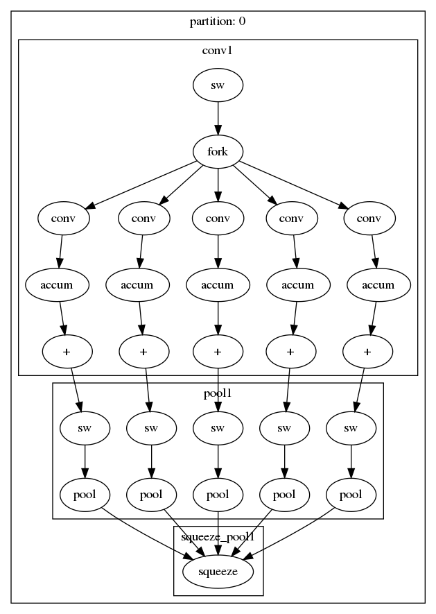
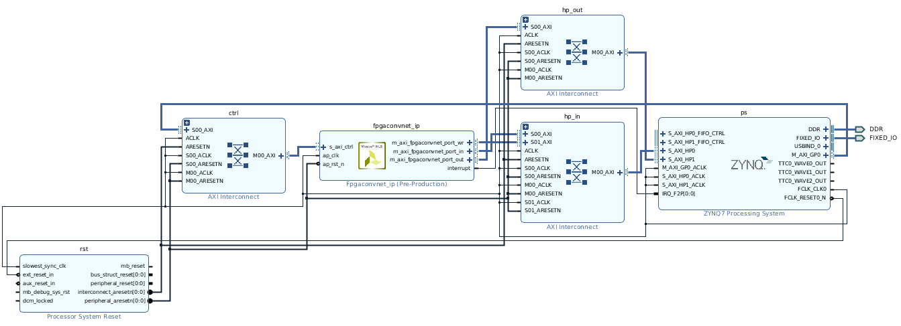

# fpgaConvNet HLS Tutorial

This tutorial covers the flow from a hardware description for an accelerator to running it on an FPGA. A simple single layer example is used in this tutorial, which looks something like this:



## Setup

All environment setup is outlined in the [optimiser](https://github.com/AlexMontgomerie/fpgaconvnet-optimiser) and [HLS](https://github.com/AlexMontgomerie/fpgaconvnet-hls) repos respectively. For this tutorial, you will need to download the relevant files from [here](https://imperialcollegelondon.box.com/shared/static/m8694gokmolvy6y6n4czhujeqchu3f0i.zip). This example is targeted for the ZC706 development board, however this should be able to target any Xilinx Zynq-based device.

## Generating Bitstream

The complete flow from hardware description to bitstream can be run using a single script. From within the unzipped folder, run the following command:

```
$FPGACONVNET_HLS/scripts/run_network.sh -n single_layer \
    -m single_layer.onnx \
    -d input_example.png \
    -p single_layer.prototxt \
    -b xilinx.com:zc706:part0:1.4 \
    -f xc7z045ffg900-2 \
    -g
```

This script creates a the HLS code, formats both the weights and input image, and implements the design for the FPGA part. You can look at the commands that are called in the `run_network.sh` script. The synthesised design looks like this:



## Running the Accelerator

The outputs of the script (found in the `outputs` folder) are the partition bitstreams, as well as the weights and featuremaps converted to a binary format. All this needs to be placed onto an SD card that can then be placed onto the FPGA board. To run the accelerator, you can use the xsdk script in the scripts folder:

```
cd $FPGACONVNET_HLS
xsct scripts/run_sdk.tcl host/devices/zc706/fpgaconvnet.hdf -create
```

This script creates an xsdk project in the `host` folder, and starts running the FPGA. Performance readings are printed to the UART port. You can view this by connecting to the UART port via the `screen` command, such as:

```
sudo screen /dev/ttyUSB0 115200
```

> The device may be different

You should see an output similar to the following:

```
starting ... 

------   Initialisation                 ------
------ hardware         : DONE          ------
------ timer            : DONE          ------
------ sd card          : DONE          ------
------ reconfig         : DONE          ------
------ config           : DONE          ------

------   Hardware Status : READY        ------
Reconfiguring partition Partition (partition index : 0)
Loading Input (partition index : 0)
 ERROR: File: 'i0.bin', Expected size: 6272; Actual size: 1605632
 Running Partition (partition index : 0, weights reloading index : 0)
 Saving Output (partition index : 0)
 --------------------------------------------------------------
 ------           Printing Profiling Information         ------
 --------------------------------------------------------------
 ------           Partition ID : ( 0 )                   ------
 ------   load input time                : 89.016 (ms)   ------
 ------   load partition time            : 110.699 (ms)  ------
 ------   read weights from SD card (avg): 0.000 (ms)    ------
 ------   write weights to PL (avg)      : 0.000 (ms)    ------
 ------   running partition (avg)        : 7.123 (ms)    ------
 ------   saving output                  : 54.413 (ms)   ------
 --------------------------------------------------------------
 ------   TOTAL TIME                     : 261.252 (ms)  ------
 --------------------------------------------------------------
 done! 
```

The output featuremaps will be saved to a file on the SD card called `O0.BIN`.

